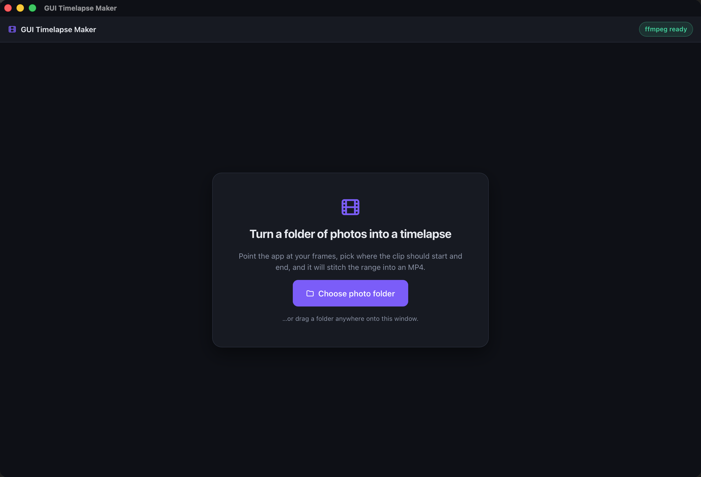
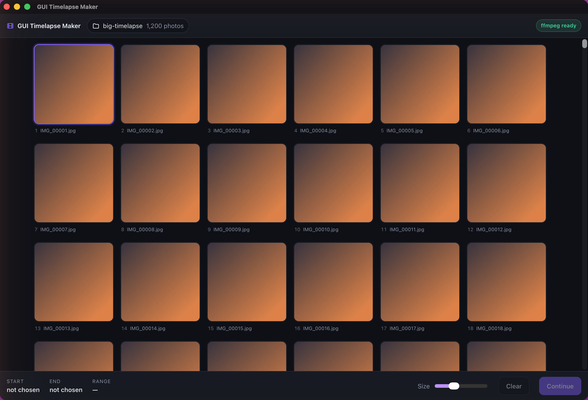
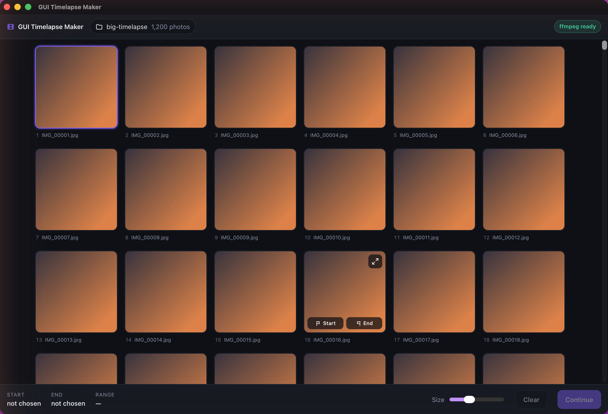
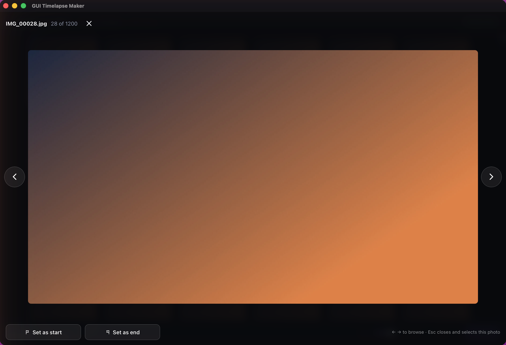
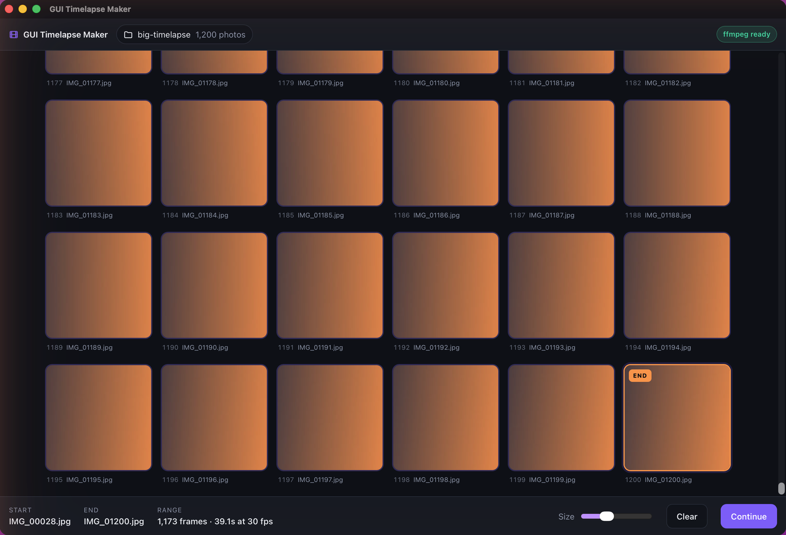
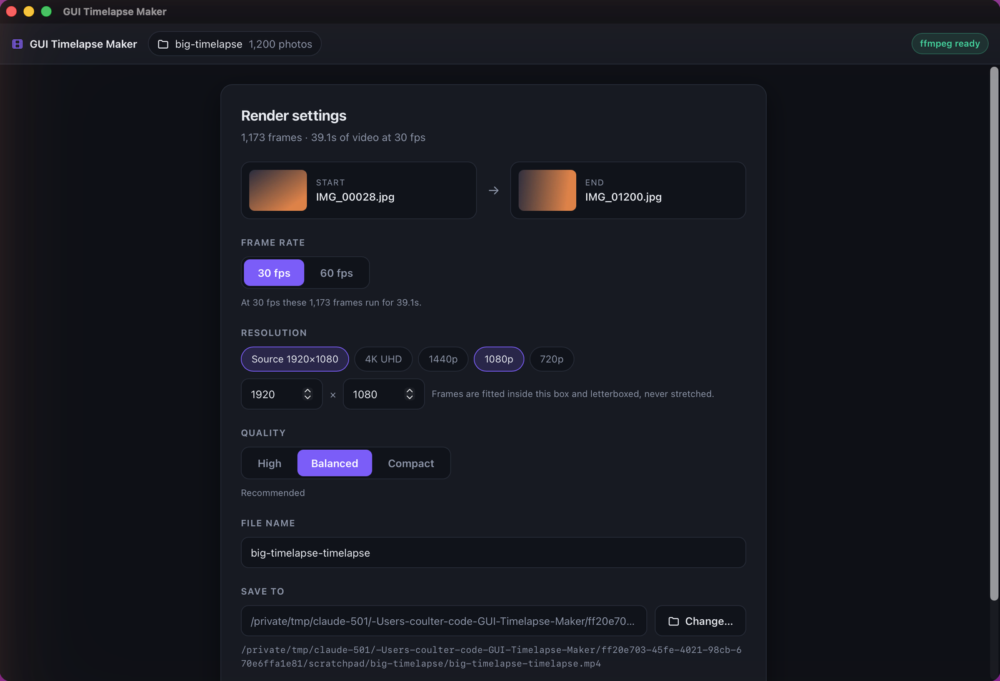
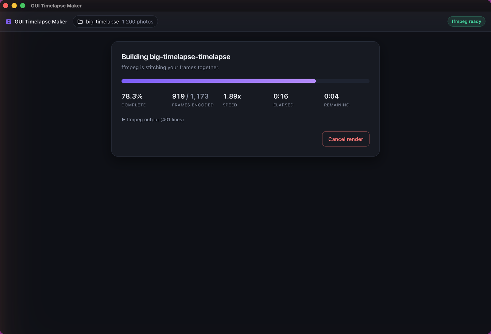
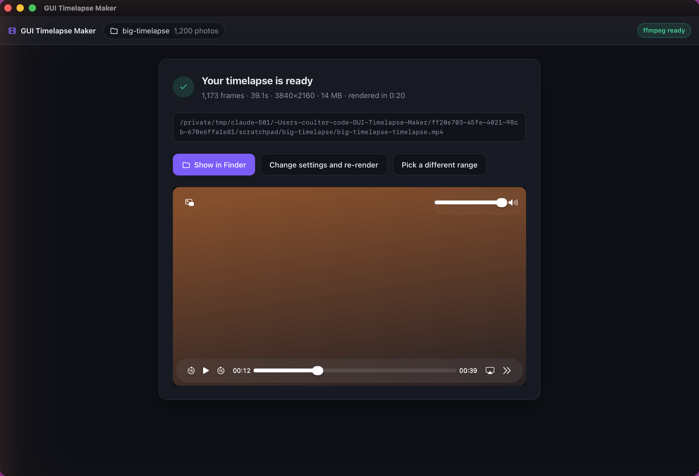

# GUI Timelapse Maker

Point it at a folder of photos, pick the first and last frame you want, get an MP4.



I shoot a lot of timelapses and the annoying part was never the encoding — it was
figuring out *which* frames I actually wanted. The first forty are me fiddling with
the tripod and the last sixty are after the light has gone. Every tool I tried
wanted the whole folder, so I'd end up hand-copying a subset into a scratch
directory first.

This does the trimming in the app. You scroll through the frames, click Start on one
and End on another, and it encodes only that range. It's an expanded take on
[Aurora-Hunters/timelapse-maker](https://github.com/Aurora-Hunters/timelapse-maker),
rebuilt in Tauri so the download is a few megabytes instead of a bundled browser.

## Installing

Grab the installer for your platform from the
[latest release](https://github.com/coulterpeterson/GUI-Timelapse-Maker/releases/latest)
— `.dmg` for macOS, `.msi` for Windows, `.AppImage` or `.deb` for Linux.

**You need ffmpeg.** The app shells out to it and won't render without it. There's a
chip in the top right that tells you whether it was found:

| | |
|---|---|
| macOS | `brew install ffmpeg` |
| Windows | `winget install ffmpeg` |
| Debian/Ubuntu | `sudo apt install ffmpeg` |

It looks on your `PATH` plus the usual install prefixes, so a Homebrew install gets
picked up even though apps launched from Finder don't inherit your shell's `PATH`.

## Using it

Pick a folder and every image in it shows up in a grid, sorted the way you'd expect
— `IMG_9.jpg` comes before `IMG_10.jpg`, not after it.



Only the rows on screen are rendered, so scrolling stays smooth no matter how big the
folder is. Thumbnails are cached on disk, so the first pass over a few thousand
untouched frames takes a moment to fill in and every visit after that is instant.

Hovering a photo gives you an expand button and the two range buttons:



Expand opens the carousel. Arrow keys or the side buttons move through the folder,
and there's a Set as start / Set as end button on each frame so you can commit to one
without going back to the grid. Close it and whichever photo you were looking at is
the one selected in the grid — handy when you've been stepping through looking for
the exact moment the clouds break.



Your range shows up along the bottom, with the frame count and how long the clip will
run:



Pick an end frame that comes *before* your start frame and it renders in reverse
rather than complaining at you.

Then the settings. Resolution defaults to whatever your start photo is, so most of
the time you can leave everything alone and hit render.



Frames are fitted inside the resolution box and letterboxed rather than stretched, so
picking a different aspect ratio won't squash anything.



When it's done you get the video inline, and a button to jump straight to it in
Finder or Explorer.



## Keyboard shortcuts

| Key | In the grid | In the carousel |
|---|---|---|
| `←` `→` `↑` `↓` | Move between photos | `←` `→` step through photos |
| `Enter` | Open the carousel | — |
| `Esc` | — | Close, keeping this photo selected |
| `[` | Set start frame | Set start frame |
| `]` | Set end frame | Set end frame |
| `Home` / `End` | First / last photo | First / last photo |

## Building it yourself

Needs Node 20+ and a Rust toolchain.

```bash
npm install
npm start
```

`npm start` runs it in dev mode with hot reload. `npm run bundle` produces installers
for whatever platform you're on. `cargo test --manifest-path src-tauri/Cargo.toml`
runs the Rust tests — one of them shells out to a real ffmpeg and checks the output
frame count, so it's skipped if you don't have ffmpeg installed.

Releases are built by GitHub Actions when you publish a release; see
[.github/workflows/release.yml](.github/workflows/release.yml).

## A note on the encoding

Frames go to ffmpeg through the concat demuxer with the frame rate set on the input:

```
ffmpeg -r 30 -f concat -safe 0 -i frames.txt \
  -vf "scale=W:H:force_original_aspect_ratio=decrease:flags=lanczos,pad=...,setsar=1" \
  -r 30 -fps_mode cfr -frames:v N \
  -c:v libx264 -preset medium -crf 20 -pix_fmt yuv420p -movflags +faststart out.mp4
```

The obvious approach — a `duration` line after each file — quietly produces one extra
frame at the tail once ffmpeg resamples to constant frame rate. Setting `-r` on the
demuxer instead gives you exactly the frames you selected, and `-frames:v` pins it
regardless. There's a test covering this at 30 and 60 fps.

## License

MIT. See [LICENSE](LICENSE).
